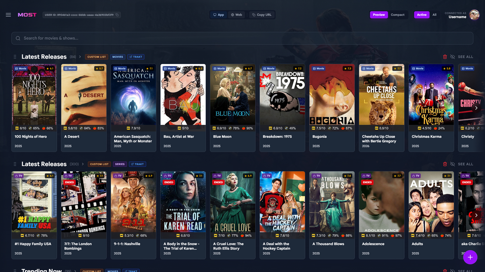
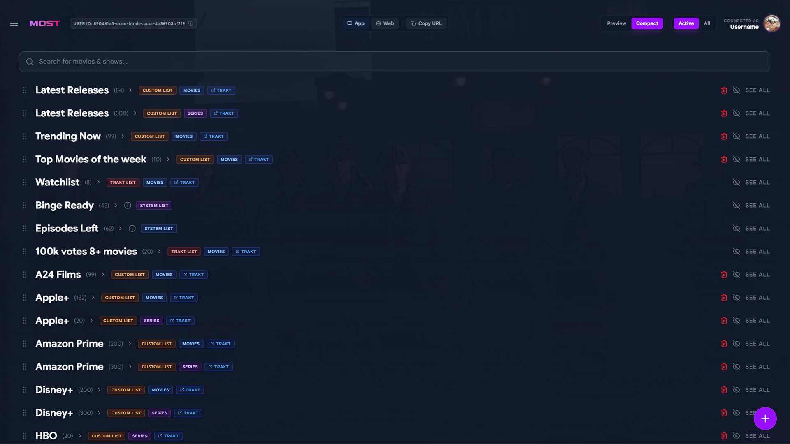
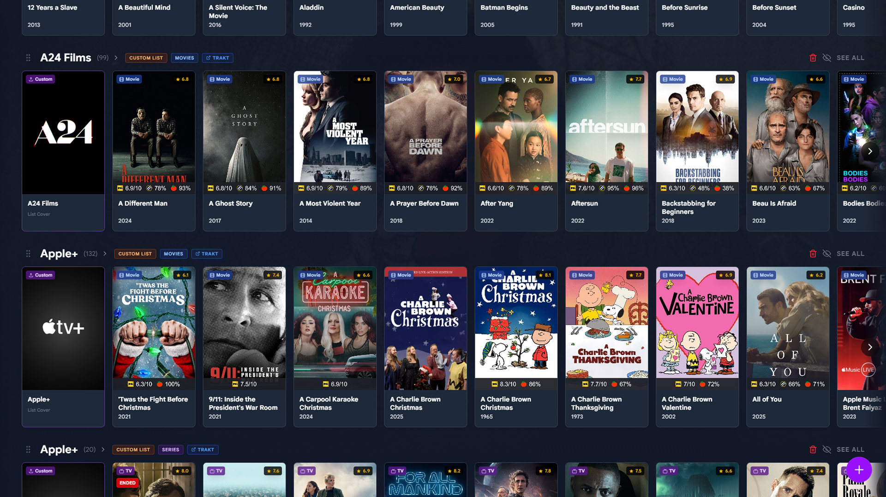
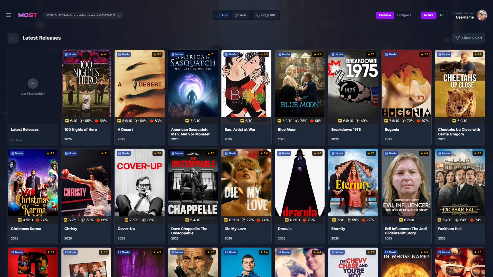
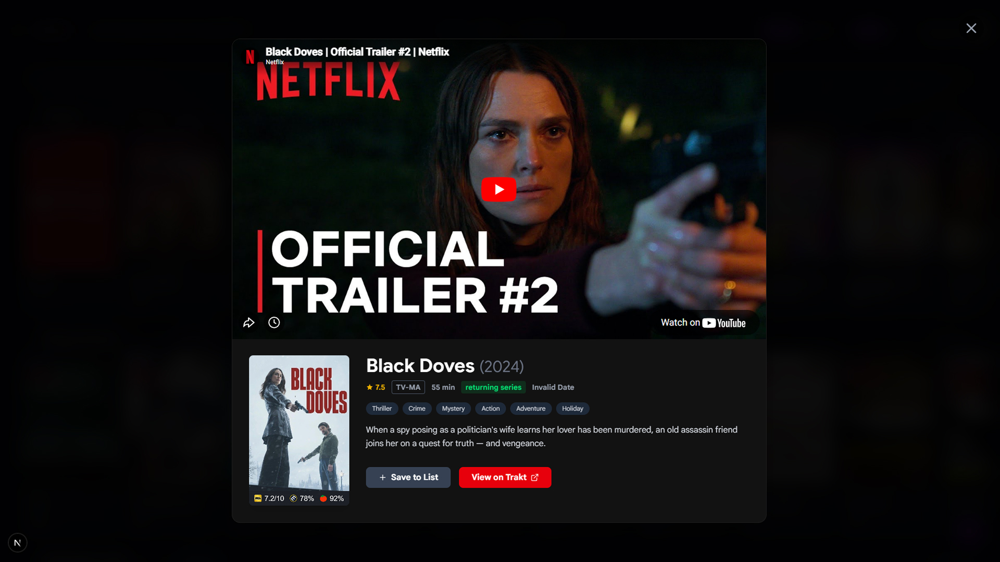

# Most

<div align="center">

**Media Organizer for Stremio & Trakt**

[](https://hub.docker.com/r/gordlaben/most)
[](https://hub.docker.com/r/gordlaben/most)
[](https://hub.docker.com/r/gordlaben/most)
[](https://discord.gg/J5MSkJk7C6)
<br/>
[](https://opensource.org/licenses/MIT)
[](https://trakt.tv)

<p align="center">
  
</p>

**Most** (Media Organizer for Stremio & Trakt) is a self-hosted dashboard that gives you full control over your Stremio library.

It solves the problem of messy, slow-loading catalogs. With Most, you can visually organize your Trakt lists exactly how you want them to appear on your TV. It runs locally to cache metadata and images, making your Stremio add-ons load instantly.

It also helps you wait. Instead of checking every week for new episodes, the "Binge Ready" filter only shows you series that have finished airing a complete season.

[Features](#features) • [Installation](#installation) • [Stremio](#stremio-integration) • [Configuration](#configuration)

</div>

<br />

<!-- Main Screenshot -->
<p align="center">
  
</p>

<!-- Gallery -->
<p align="center">
  
  
</p>
<p align="center">
  
  
</p>

---

## ✨ Features

*   **🎬 Native Stremio Addon**: Feeds your curated lists directly into your streaming hub.
*   **🖥️ Visual Dashboard**: Manage your lists in a browser interface that looks and feels like Stremio.
*   **🎯 Binge Tracking**: Filters your watchlist. Shows only appear when a full season has finished airing.
*   **🖼️ List Headers**: Injects visual separators (covers) in Stremio so you can easily tell your lists apart while scrolling.
*   **🔄 Two-Way Sync**: Everything you do in Most syncs back to Trakt.tv, and vice versa.
*   **👥 Multi-User**: Supports multiple profiles, so everyone in the house can use their own Trakt account.
*   **📅 Calendar Feed**: Generates a personal `.ics` link for your calendar apps so you know when a binge is coming up.
*   **⚡ Local Caching**: Caches metadata and RPDB posters locally. Your lists load instantly because they aren't waiting for external APIs.
*   **🛡️ Privacy**: Self-hosted. Your data stays on your server.

---

## 🚀 Getting Started

### Prerequisites

*   **Trakt.tv API App**: You need a Trakt API Client ID and Secret.
    1.  Go to [trakt.tv/oauth/applications](https://trakt.tv/oauth/applications)
    2.  Click "New Application"
    3.  Name: `Most` (or anything you like)
    4.  Redirect URI: `http://<your-domain-or-ip>:3000/api/auth/callback`
    5.  Javascript (CORS) origins: `http://<your-domain-or-ip>:3000`

### 🐳 Installation (Docker)

The recommended way to run Most is via Docker Compose.

1.  Create a `docker-compose.yml` file:

```yaml
services:
  most:
    image: gordlaben/most:latest
    container_name: most
    restart: unless-stopped
    ports:
      - "3000:3000"
    environment:
      # Required: Database location
      - DATABASE_URL=file:/app/data/prod.db
      
      # Optional: Pre-configure Trakt (can also be done in UI)
      - TRAKT_CLIENT_ID=your_client_id
      - TRAKT_CLIENT_SECRET=your_client_secret

      # Optional: Gemini AI semantic search
      - GEMINI_API_KEY=your_gemini_key
      - GEMINI_MODEL=gemini-flash-latest
      
      # Required: Your public URL for Stremio/Calendar links
      - NEXT_PUBLIC_BASE_URL=http://localhost:3000

      # Optional: Used to ensure correct image proxy links and redirects
      - APP_URL=http://localhost:3000

      # Optional: Secure the /admin dashboard
      - ADMIN_PASSWORD=secure_password

      # Optional: Disable public registration
      - ENABLE_REGISTRATION=true
    volumes:
      - ./data:/app/data
```

2.  Run the container:

```bash
docker-compose up -d
```

3.  Open `http://localhost:3000` in your browser.

### 🛠️ Installation (Manual)

<details>
<summary>Click to expand manual installation steps</summary>

1.  **Clone the repository**
    ```bash
    git clone https://github.com/gordlaben/most.git
    cd most
    ```

2.  **Install dependencies**
    ```bash
    npm install
    ```

3.  **Setup Environment**
    ```bash
    cp .env.example .env
    # Edit .env with your database URL and keys
    ```

4.  **Initialize Database**
    ```bash
    npx prisma generate
    npx prisma db push
    ```

5.  **Run Development Server**
    ```bash
    npm run dev
    ```
</details>

---

## ⚙️ Configuration

You can configure Most using environment variables in your `docker-compose.yml` or `.env` file.

| Variable | Description | Default |
|----------|-------------|---------|
| `DATABASE_URL` | Connection string for Prisma. Use `file:/app/data/prod.db` for SQLite in Docker. | `file:./dev.db` |
| `NEXT_PUBLIC_BASE_URL` | The public URL of your installation. Used for generating calendar and Stremio links. | `http://localhost:3000` |
| `APP_URL` | Used internally to construct absolute URLs (e.g. for Stremio manifests) and fix image proxy redirects. | `http://localhost:3000` |
| `TRAKT_CLIENT_ID` | Your Trakt.tv Application Client ID. | - |
| `TRAKT_CLIENT_SECRET` | Your Trakt.tv Application Client Secret. | - |
| `GEMINI_API_KEY` | (Optional) Gemini API key for semantic search. | - |
| `GEMINI_MODEL` | (Optional) Gemini model to use. | `gemini-flash-latest` |
| `ADMIN_PASSWORD` | (Optional) Password for accessing the `/admin` dashboard to manage users. | - |
| `ENABLE_REGISTRATION` | Set to `false` to disable the "Create Profile" form. Useful for private instances. | `true` |

---

## 📺 Integrations

### Stremio Integration
Most acts as a Stremio addon. To add it to Stremio:
1.  Log in to your Most dashboard.
2.  Click the **Stremio** button in the navigation or settings.
3.  Click "Install on Stremio".
4.  Go back to the Dashboard and enjoy your freshly created Lists ❤️

### Calendar Feed
Never miss a binge date. Most provides a standard ICS subscription link.
1.  Log in to your Most dashboard.
2.  Click the **Calendar** icon/button.
3.  Copy the provided URL.
4.  Paste it into Google Calendar ("Add from URL") or Apple Calendar ("New Calendar Subscription").

---

## 🛠️ Tech Stack

*   **Framework**: [Next.js 15](https://nextjs.org/) (App Router)
*   **Styling**: [Tailwind CSS](https://tailwindcss.com/)
*   **Database**: SQLite with [Prisma ORM](https://www.prisma.io/)
*   **Authentication**: Custom Auth + Trakt OAuth
*   **Containerization**: Docker

---

## 📄 License

This project is licensed under the MIT License - see the [LICENSE](LICENSE) file for details.

---

## ⚖️ Disclaimer

**Most** is a dedicated metadata management tool designed solely for organizing personal watch history and lists via integration with the Trakt.tv API.

This software **does not** host, distribute, index, or provide access to any copyrighted audio/visual content, streams, torrents, or magnet links. It operates strictly as a metadata aggregator and organizational utility. The developers of Most do not condone, endorse, or facilitate piracy in any form.

Users are solely responsible for ensuring their use of this software complies with all applicable local, federal, and international laws and regulations regarding copyright and media rights. The developers accept no liability for any potential misuse of this application.

